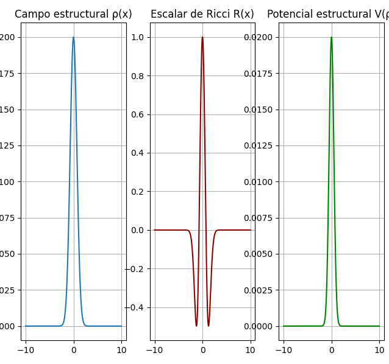

# Twistor-Structural Quantum Vacuum Theory (TSQVT)

[](https://opensource.org/licenses/MIT)



## Summary

**Twistor-Structural Quantum Vacuum Theory (TSQVT)** is a theoretical framework in which spacetime and particle mass are emergent phenomena. The theory posits that geometry is identified with a scalar structural field, $\rho(x)$, whose dynamics originate from a pre-geometric substrate described by a noncommutative twistor algebra.

[cite_start]This approach offers a new perspective on the interplay between inertia, geometry, and quantum dynamics, and provides conceptual solutions to long-standing problems such as the Higgs hierarchy problem and the unification of gravity with the Standard Model interactions [cite: 683-1517].

## Key Publications

This repository contains the numerical code that supports the following publications:

1.  **The Foundational Theory:**
    * Makraini, M. (2025). *Twistor-Structural Quantum Vacuum Theory*. Zenodo. [https://doi.org/10.5281/zenodo.16660879](https://doi.org/10.5281/zenodo.16660879)

2.  **Rigorous Formulation and Experimental Constraints:**
    * Makraini, M. (2025). *A Rigorous Formulation of the Twistor-Structural Quantum Vacuum: Hermiticity, Derivations, and Experimental Constraints*. Submitted to *Physical Review Letters*.

3.  **Mathematical Construction of the Formalism:**
    * Makraini, M. (2025). *A Formal Construction of a Lorentzian Gauge-Twistorial Spectral Quadruplet*. Submitted to *Communications in Mathematical Physics*.

## About This Repository

[cite_start]This repository contains the Python code used to perform the phenomenological analyses of TSQVT, including the perturbative calculations for the hydrogen atom and the generation of the parameter exclusion plots [cite: 821-831, 1012-1016].

## 🚀 Installation

To clone the repository and set up the environment, run the following commands:

```bash
git clone [https://github.com/KerymMacryn/VA-Theory.git](https://github.com/KerymMacryn/VA-Theory.git)
cd VA-Theory/codigo
pip install -r requirements.txt
```

## ⚙️ Usage

The main script performs the calculations and generates the figures. To run an example simulation:

```bash
python VA_simulations.py
```

[cite_start]This will calculate the energy shifts in the hydrogen atom and reproduce the $(\epsilon, R)$ parameter exclusion plot presented in the publication on the theory's rigorous formulation [cite: 1044-1068].

## How to Cite

If you use this code or the results of the TSQVT framework in your research, please cite the foundational paper:

```bibtex
@software{Makraini_TSQVT_2025_Zenodo,
  author       = {Makraini, Mohamed},
  title        = {Twistor-Structural Quantum Vacuum Theory},
  month        = {aug},
  year         = {2025},
  publisher    = {Zenodo},
  doi          = {10.5281/zenodo.16660879},
  url          = {[https://doi.org/10.5281/zenodo.16660879](https://doi.org/10.5281/zenodo.16660879)}
}
```

## 📜 License

This project is licensed under the MIT License. See the `LICENSE` file for details.

=======
>>>>>>> 5ceb45144ccfb5c7d5c92f85cfb03d5c6d9c0186
