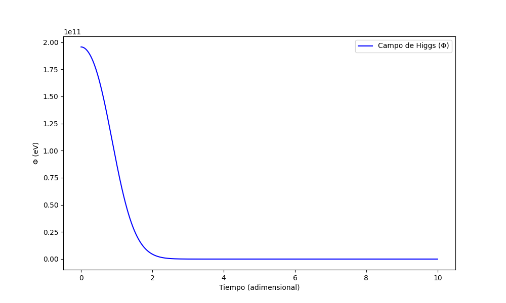

<<<<<<< HEAD
#  Teoría del Vacío Absoluto (VA)



## 📌 Idea Central
**El Vacío Absoluto (VA)** es un sustrato pre-geométrico que:
- ✨ Genera gravedad como gradiente de densidad VA/ET.
- 🔗 Explica el entrelazamiento cuántico como no-localidad en el VA.
- 🧲 Unifica QCD y gravedad sin infinitos.

## 🚀 Instalación
```bash
git clone https://github.com/KerymMacryn/VA-Theory.git
cd VA-Theory/codigo
pip install -r requirements.txt
python VA_simulations.py
=======
# VA-Theory

=======
>>>>>>> 5ceb45144ccfb5c7d5c92f85cfb03d5c6d9c0186
